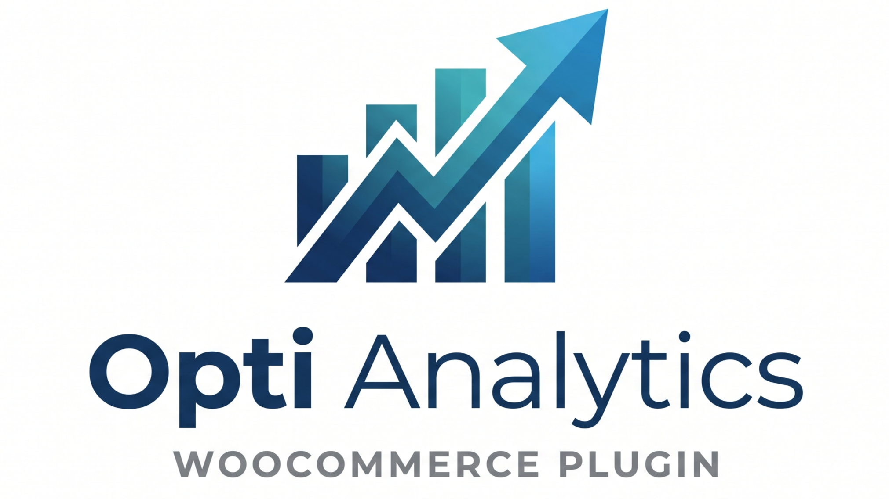

<p align="center">
  
</p>

<p align="center">
  <a href="https://www.gnu.org/licenses/gpl-3.0"></a>
  <a href="https://woocommerce.com/"></a>
  <a href="https://php.net/"></a>
</p>

**Opti Analytics** is a high-performance sales analytics and financial reporting plugin for WooCommerce. It empowers store owners with deep insights into their profitability by integrating custom data points, tracking actual costs, and providing a dynamic, customizable dashboard.

## 🚀 Summary

Standard WooCommerce reporting often misses the "hidden" costs of doing business. Opti Analytics bridges this gap by allowing you to track **Cost of Goods Sold (COGS)**, manual shipping expenses, and any custom meta fields (like payment fees or specialized taxes) directly within your sales reports. Built with modern PHP 8.1+ standards and fully compatible with WooCommerce's High-Performance Order Storage (HPOS), it ensures your reporting stays fast as your store grows.

## ✨ Key Features

- **📊 Comprehensive P&L Engine**: Real-time calculation of Gross Profit, Net Profit, and Profit Margin based on your custom revenue and cost rules.
- **🔄 Smart Field Mapping**: Map any custom Order or Product meta keys to **Revenue** or **Cost** categories to see their impact on your bottom line.
- **🛡️ Historical COGS Tracking**: Automatically snapshots Cost of Goods Sold at the time of purchase. This ensures your reports remain accurate even if you change product prices later.
- **📦 Manual Shipping Reconciliation**: Input your *actual* shipping costs per order to compare against what you collected from customers.
- **👁️ View Only Mode**: Track and display metrics (like reward points or custom attributes) for informational purposes without affecting your P&L totals.
- **🔍 Auto-Discovery**: Automatically scans your database to find available meta keys, making setup as simple as a few clicks.
- **⚡ HPOS Compatible**: Fully optimized for WooCommerce High-Performance Order Storage (HPOS) and legacy postmeta.
- **🎨 Customizable Dashboard**: Toggle KPI cards on/off and filter by preset or custom date ranges.

## 🛠️ Installation

### Standard Installation (Recommended)
1. Download the latest release `.zip` file from the [Releases](https://github.com/noor-siddiqui/Opti-Analytics/releases) page.
2. In your WordPress admin, go to **Plugins > Add New > Upload Plugin**.
3. Choose the downloaded `.zip` file and click **Install Now**.
4. **Activate** the plugin.

### For Developers
1. Clone the repository: `git clone https://github.com/noor-siddiqui/Opti-Analytics.git`
2. Install dependencies: `composer install --no-dev`
3. Activate via the WordPress Dashboard.

## 📖 Usage

1. **Configure Sources**: Go to **Opti Analytics > Settings**.
   - Select which built-in metrics (Total Sales, Shipping, etc.) count as Revenue or Costs.
   - Use the **Browse discovered fields** panel to add your custom meta keys to the Revenue, Cost, or View Only categories.
2. **Dashboard**: Navigate to **WooCommerce > Opti Analytics**.
   - View your performance overview and the dedicated **Profit & Loss** section.
   - Use the vertical ellipsis (⋮) to customize which cards are visible.
3. **Record Shipping**: On any Order edit screen, find the **Actual Shipping Cost** field to record your true expenses.

## 💻 Development

This plugin follows strict typing and WordPress Coding Standards (WPCS).

### Linting & Fixing
```bash
composer run check   # Runs PHPCS and PHPCBF
composer run phpcs   # Check only
composer run phpcbf  # Fix only
```

## 📄 License

This project is licensed under the GNU General Public License v3.0 - see the [LICENSE](LICENSE) file for details.

## 👨‍💻 Developer

**Author:** Noor Nabiul Alam Siddiqui
**Email:** [siddiqui.sazal@gmail.com](mailto:siddiqui.sazal@gmail.com)
